# Inventario App — Pipeline CI/CD con Docker y Kubernetes

Inventario App es una aplicación web desarrollada con Node.js y Express para consultar, crear y eliminar productos de un catálogo. Los datos se guardan en un archivo JSON local. Este repositorio se utiliza para practicar un flujo completo de integración y entrega continua: pruebas automáticas, creación y análisis de una imagen Docker, publicación en GitHub Container Registry y despliegue en Kubernetes.

Repositorio público: [github.com/miguis145/inventario-app](https://github.com/miguis145/inventario-app)

## 2. Integrantes

- José Vanegas
- Miguel Vanegas

## 3. Objetivos

Esta práctica tiene los siguientes objetivos:

- Ejecutar pruebas automáticas antes de construir y publicar la aplicación.
- Crear una imagen con un Dockerfile multi-stage.
- Implementar un pipeline CI/CD con GitHub Actions.
- Publicar imágenes en GitHub Container Registry (GHCR).
- Etiquetar cada imagen con el SHA del commit y con `latest`.
- Analizar vulnerabilidades con Trivy.
- Desplegar la aplicación en Kubernetes.
- Actualizar los pods mediante Rolling Update.
- Configurar readiness y liveness probes con un arranque lento real.
- Inyectar y consumir una variable mediante un Secret de Kubernetes.
- Desplegar las versiones Blue y Green en paralelo.
- Demostrar un rollback mediante el selector del Service.
- Observar qué ocurre con los datos cuando no existe almacenamiento persistente.

## 4. Tecnologías utilizadas

| Tecnología | Uso en la práctica |
|---|---|
| Node.js | Entorno de ejecución de la aplicación y de las pruebas |
| Express | Servidor web y API REST |
| npm | Instalación reproducible de dependencias y ejecución de scripts |
| Docker | Construcción y ejecución de la imagen del contenedor |
| Git | Control de versiones y obtención de los SHA |
| GitHub Actions | Automatización de pruebas, construcción, análisis y publicación |
| GitHub Container Registry | Registro de las imágenes Docker |
| Trivy | Análisis de vulnerabilidades de la imagen |
| Kubernetes | Orquestación de contenedores |
| kubectl | Administración de los recursos de Kubernetes |
| Minikube | Clúster local de Kubernetes |
| PowerShell | Ejecución de los comandos de la práctica en Windows |

## 5. Estructura del repositorio

El siguiente árbol resume los archivos principales que existen en el repositorio:

```text
inventario-app/
├── .github/
│   └── workflows/
│       └── ci-cd.yml
├── data/
│   ├── .gitkeep
│   └── products.json
├── evidencias/
│   ├── capturas-reales/
│   │   ├── indice.md
│   │   └── 63 capturas reales clasificadas
│   ├── dora-deployments.csv
│   └── product-request.json
├── k8s/
│   ├── blue-green/
│   │   ├── deployment-blue.yaml
│   │   ├── deployment-green.yaml
│   │   └── service.yaml
│   ├── deployment.yaml
│   └── service.yaml
├── output/
│   └── pdf/
│       └── Informe_Reflexion_CI_CD_Inventario.pdf
├── public/
│   ├── app.js
│   ├── index.html
│   └── styles.css
├── scripts/
│   └── generate-evidence.ps1
├── .dockerignore
├── .gitignore
├── db.js
├── Dockerfile
├── package-lock.json
├── package.json
├── patch-blue.json
├── patch-green.json
├── README.md
├── server.js
└── server.test.js
```

El directorio `node_modules/` existe en el entorno de desarrollo, pero no se muestra porque contiene una gran cantidad de dependencias generadas. El comando `npm ci` puede reconstruirlo a partir de `package-lock.json`.

Los archivos `patch-green.json` y `patch-blue.json` se utilizan durante la práctica Blue-Green. El script `scripts/generate-evidence.ps1` permite ejecutar comprobaciones y crear imágenes legibles a partir de sus salidas reales. Las capturas entregadas para este informe se conservan, sin alterar su contenido, en `evidencias/capturas-reales/`.

## 6. Requisitos previos

Se necesita Windows PowerShell y los siguientes programas:

- Node.js 24, que coincide con la versión configurada en el pipeline y en el Dockerfile.
- npm.
- Git.
- Docker Desktop con el motor de Docker iniciado.
- kubectl.
- Minikube.

Se puede comprobar la instalación con:

```powershell
node --version
npm --version
git --version
docker --version
kubectl version --client
minikube version
```

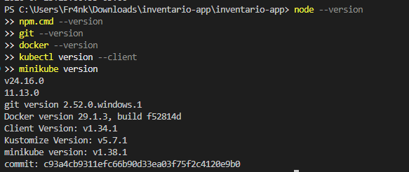

Cada comando debe mostrar su versión. Si PowerShell indica que un comando no existe, se debe instalar la herramienta correspondiente y abrir una terminal nueva.

En algunos equipos, la política de ejecución de PowerShell bloquea `npm.ps1`. En ese caso se puede usar el ejecutable equivalente, por ejemplo `npm.cmd --version`, `npm.cmd ci`, `npm.cmd test` o `npm.cmd start`, sin cambiar la configuración de seguridad del sistema.

## 7. Clonación y preparación

Ejecutar los comandos en el siguiente orden:

```powershell
git clone URL_DEL_REPOSITORIO
cd inventario-app
npm ci
```

Antes de ejecutar el primer comando, se debe reemplazar `URL_DEL_REPOSITORIO` por la dirección real del repositorio. `npm ci` elimina la instalación local de dependencias, si existe, e instala exactamente las versiones registradas en `package-lock.json`. Por eso es más apropiado que `npm install` para un entorno de CI/CD reproducible.

## 8. Pruebas automáticas

Ejecutar:

```powershell
npm test
```

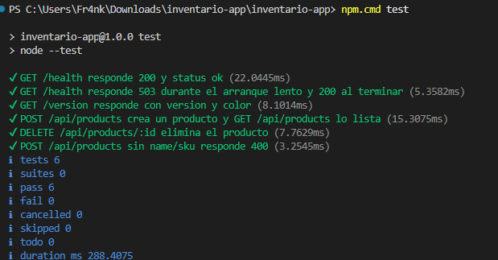

Las pruebas de `server.test.js` levantan el servidor en un puerto temporal y verifican:

- `GET /health`.
- El estado HTTP `503` de `/health` durante `STARTUP_DELAY_SECONDS` y el cambio a `200` cuando termina.
- `GET /version`, incluida la confirmación de que `API_KEY` fue inyectada sin mostrar su valor.
- La creación y consulta de productos.
- La eliminación de un producto y la respuesta `404` posterior.
- La validación de los campos obligatorios `name` y `sku`.

Una prueba fallida debe detener el proceso. En GitHub Actions, el job de publicación no se ejecuta si falla el job de pruebas. El Dockerfile vuelve a ejecutar `npm test`, así que una falla también interrumpe `docker build`.

## 9. Ejecución local

Iniciar la aplicación:

```powershell
npm start
```

La terminal debe permanecer abierta mientras se prueba el servidor. En otra ventana de PowerShell, ejecutar:

```powershell
curl.exe http://localhost:3000/
curl.exe http://localhost:3000/health
curl.exe http://localhost:3000/version
curl.exe http://localhost:3000/api/products
```

Los endpoints cumplen estas funciones:

| Endpoint | Función |
|---|---|
| `/` | Entrega la interfaz web ubicada en `public/` |
| `/health` | Comprueba que la aplicación puede leer y escribir el archivo de datos; responde con estado HTTP `200` cuando está disponible |
| `/version` | Devuelve la versión, el color y el nombre del host que atendió la solicitud |
| `/api/products` | Devuelve el catálogo de productos en formato JSON |

La aplicación también dispone de operaciones `POST`, `PATCH` y `DELETE` para administrar productos. Para detener el servidor local se utiliza `Ctrl+C` en la primera terminal.

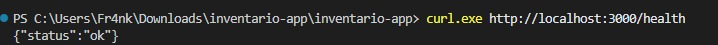

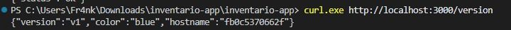

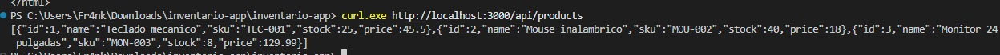

## 10. Dockerfile multi-stage

El `Dockerfile` utiliza `node:24-alpine3.24` en dos etapas:

1. La etapa `test` copia los archivos de dependencias, ejecuta `npm ci`, incorpora el código y las pruebas, y termina con `npm test`.
2. La etapa `production` instala solo las dependencias de producción, limpia la caché y elimina npm de la imagen final. Después copia `server.js`, `db.js` y `public/` desde la etapa `test`, crea `/app/data`, expone el puerto `3000` e inicia el servidor con Node.js.

La copia desde `test` obliga a BuildKit a ejecutar esa etapa antes de crear producción. La etapa final no copia `server.test.js` ni las dependencias usadas durante la prueba.

Construir la imagen:

```powershell
docker build -t inventario-app:local .
docker images inventario-app
```

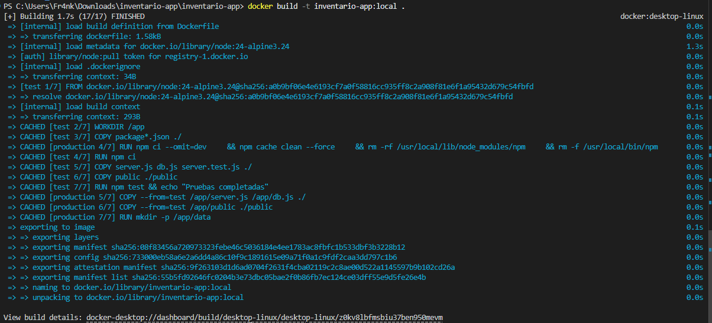

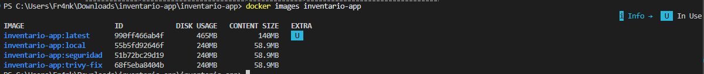

Ejecutar la imagen:

```powershell
docker run -d --name inventario-local -p 3000:3000 inventario-app:local
docker ps
docker logs inventario-local
```

Probar el contenedor:

```powershell
curl.exe http://localhost:3000/
curl.exe http://localhost:3000/health
curl.exe http://localhost:3000/version
curl.exe http://localhost:3000/api/products
```

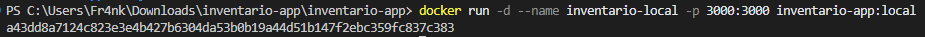

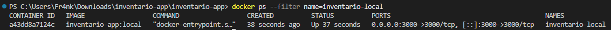

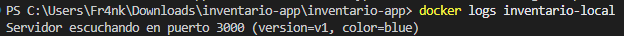

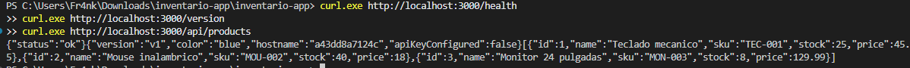

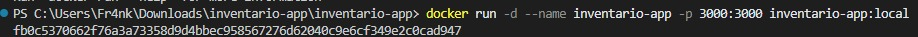

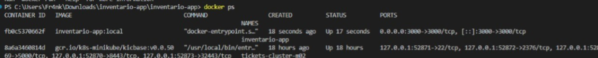

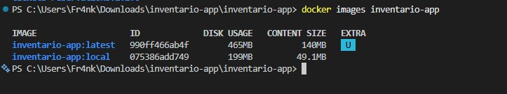

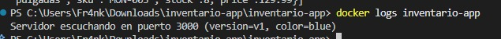

Eliminar el contenedor al terminar:

```powershell
docker rm -f inventario-local
```

El comando `RUN npm test` forma parte de la primera etapa. Si una prueba falla, Docker devuelve un error y no crea la imagen final.

## 11. Pipeline de GitHub Actions

El pipeline está definido en:

```text
.github/workflows/ci-cd.yml
```

Se ejecuta con cada `push` a la rama `main` y también se puede iniciar manualmente con `workflow_dispatch`. El workflow concede permiso de lectura al contenido y permiso de escritura para publicar paquetes.

### Job `build-test`

Este job:

1. Descarga el repositorio.
2. Configura Node.js 24 y la caché de npm.
3. Ejecuta `npm ci`.
4. Ejecuta `npm test`.

### Job `build-push`

Este job:

1. Descarga el repositorio.
2. Configura Docker Buildx.
3. Forma el nombre de la imagen en minúsculas a partir de `GITHUB_REPOSITORY`.
4. Inicia sesión en GHCR con `GITHUB_TOKEN`.
5. Construye la imagen localmente para analizarla.
6. Ejecuta Trivy.
7. Publica las etiquetas del SHA y `latest`.

La dependencia entre ambos jobs se declara así:

```yaml
needs: build-test
```

Esto aplica el principio fail-fast: el proceso se detiene tan pronto como se detecta un error que invalida las etapas siguientes. Si las pruebas fallan, no se construye ni se publica una imagen. Si Trivy encuentra una vulnerabilidad que cumple el criterio configurado, tampoco se ejecutan los comandos de publicación.

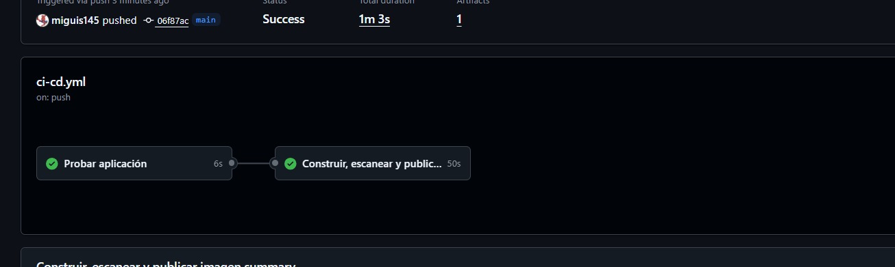

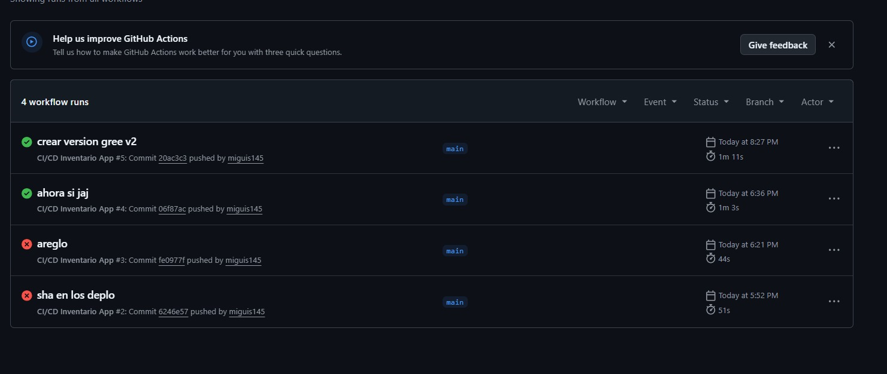

## 12. Publicación en GHCR

GitHub Container Registry, abreviado GHCR, almacena imágenes de contenedores asociadas a una cuenta u organización de GitHub. El pipeline de este repositorio publica dos referencias:

```text
ghcr.io/TU_USUARIO_GITHUB/inventario-app:SHA_DEL_COMMIT
ghcr.io/TU_USUARIO_GITHUB/inventario-app:latest
```

Se deben reemplazar `TU_USUARIO_GITHUB` y `SHA_DEL_COMMIT` por datos reales:

- El SHA identifica de forma única el código utilizado para construir una imagen. Es la etiqueta adecuada para un despliegue reproducible y un rollback.
- `latest` apunta a la publicación más reciente, pero puede cambiar con el siguiente pipeline. No identifica una versión inmutable.

Para descargar la publicación más reciente:

```powershell
docker pull ghcr.io/TU_USUARIO_GITHUB/inventario-app:latest
```

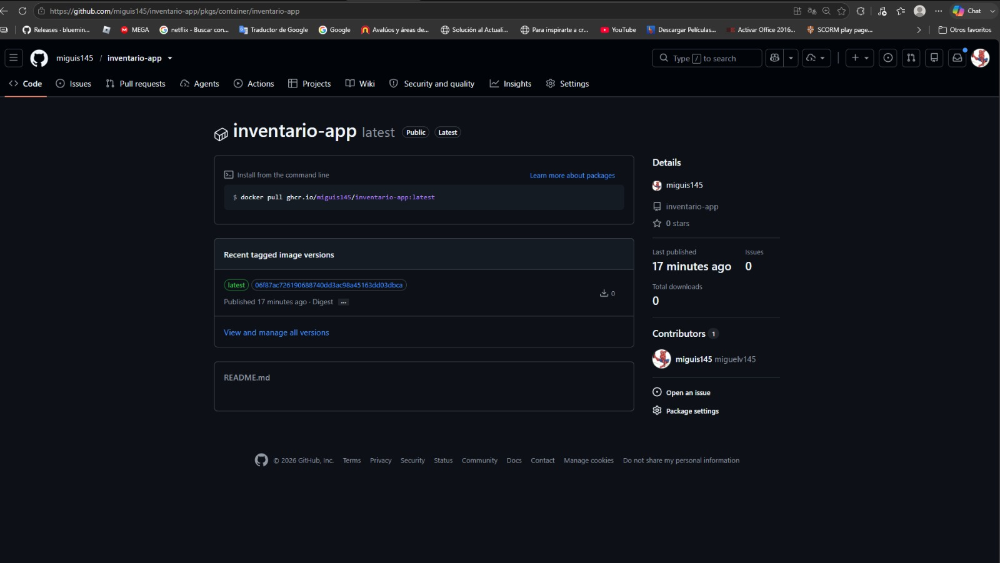

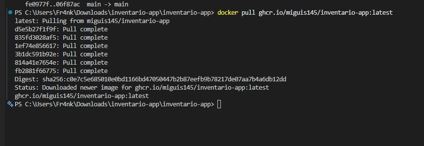

Los manifiestos de Kubernetes deben utilizar una etiqueta SHA, no `latest`, para saber con exactitud qué versión se desplegó.

## 13. Escaneo de seguridad con Trivy

El job `build-push` construye la imagen y la analiza antes de publicarla. La configuración actual examina vulnerabilidades del sistema operativo y de las bibliotecas, ignora problemas que todavía no tienen corrección y devuelve un código de error cuando encuentra una vulnerabilidad de severidad `CRITICAL`:

```yaml
exit-code: '1'
ignore-unfixed: true
severity: CRITICAL
```

El mismo criterio se puede comprobar localmente con la versión de Trivy configurada por el workflow:

```powershell
docker run --rm -v /var/run/docker.sock:/var/run/docker.sock -v trivy-cache:/root/.cache/ aquasec/trivy:0.72.0 image --quiet --timeout 10m --db-repository public.ecr.aws/aquasecurity/trivy-db:2 --scanners vuln --vuln-type os,library --format table --exit-code 1 --ignore-unfixed --severity CRITICAL inventario-app:local
```

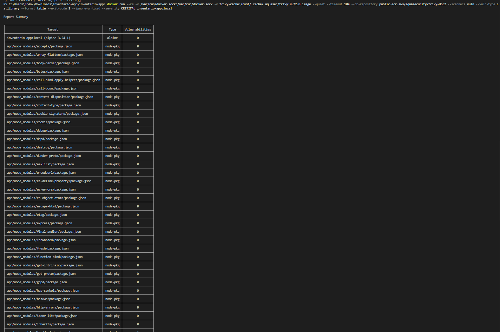

### Problema encontrado durante la práctica

Trivy puede reportar vulnerabilidades en paquetes heredados de la imagen base de Node.js, incluso en dependencias internas incluidas con npm. En esta práctica el análisis llegó a detener la publicación por una vulnerabilidad crítica. El repositorio no conserva el identificador CVE en un archivo o evidencia, por lo que no se registra uno en este README.

El diagnóstico se realiza abriendo el paso `Escanear imagen con Trivy` en GitHub Actions y revisando el paquete, la versión instalada, la severidad y la versión corregida que muestra la tabla. El Dockerfile actual reduce esa superficie en la imagen final: instala las dependencias de producción, limpia la caché y elimina npm y npx. Después de cambiar la imagen base o retirar el paquete afectado, se debe reconstruir la imagen y repetir el escaneo. No se debe desactivar el control de seguridad solo para permitir la publicación.

Durante la verificación, la descarga desde `mirror.gcr.io` y después desde `ghcr.io/aquasecurity/trivy-db:2` agotó el tiempo de espera. Se comprobó que el volumen `trivy-cache` estaba vacío y se descargó la misma base oficial desde `public.ecr.aws/aquasecurity/trivy-db:2`. El escaneo final sí terminó y reportó cero vulnerabilidades `CRITICAL`. La evidencia muestra tanto el comando exacto como el resumen real; este resultado debe volver a comprobarse para cada imagen nueva.

## 14. Inicio de Minikube

Iniciar el clúster local:

```powershell
minikube -p ci-cd start --driver=docker --cpus=4 --memory=4096
kubectl get nodes
minikube -p ci-cd status
```

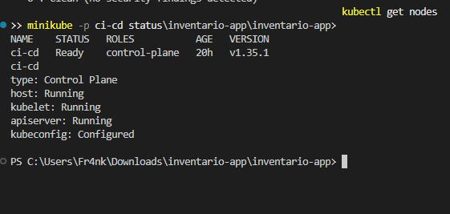

`kubectl get nodes` debe mostrar el nodo de Minikube con estado `Ready`. `minikube status` debe confirmar que el host, kubelet y API server están en ejecución antes de aplicar los manifiestos.

## 15. Secret de Kubernetes

Crear el Secret sin escribir una clave real en el repositorio:

```powershell
kubectl create secret generic inventario-secret --from-literal=API_KEY=REEMPLAZAR_CON_CLAVE_LOCAL
kubectl get secret inventario-secret
```

El campo `secretKeyRef` de los deployments toma la clave `API_KEY` del Secret `inventario-secret` y la inyecta como variable de entorno dentro del contenedor:

```yaml
- name: API_KEY
  valueFrom:
    secretKeyRef:
      name: inventario-secret
      key: API_KEY
```

`server.js` consume `process.env.API_KEY`. El endpoint `/version` expone únicamente el booleano `apiKeyConfigured`, que permite comprobar que la variable llegó al proceso sin revelar la credencial. Esta práctica demuestra inyección segura de configuración; no implementa autenticación ni devuelve el valor secreto.

La credencial debe existir solo en el clúster o en un gestor de secretos. No se debe guardar en un manifiesto, un commit, una captura ni el historial de la terminal. Para comprobar que un valor no fue agregado a los archivos versionados:

```powershell
git grep "VALOR_DE_LA_CLAVE"
```

Si el comando no devuelve coincidencias, Git no encuentra ese texto en los archivos bajo seguimiento. El historial también se debe revisar si la clave se llegó a confirmar en un commit anterior.

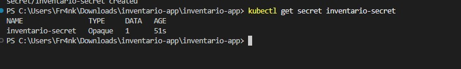

## 16. Despliegue base con Rolling Update

Antes de aplicar el deployment, reemplazar el valor de `image:` en `k8s/deployment.yaml` por una imagen publicada y accesible:

```yaml
image: ghcr.io/TU_USUARIO_GITHUB/inventario-app:SHA_DEL_COMMIT
```

Después de crear el Secret, ejecutar:

```powershell
kubectl apply -f k8s/deployment.yaml
kubectl apply -f k8s/service.yaml
kubectl rollout status deployment/inventario-app
kubectl get deployments
kubectl get pods -o wide
kubectl get service inventario-service
```

La configuración base contiene:

- `replicas: 2`, por lo que Kubernetes intenta mantener dos pods.
- `strategy: RollingUpdate`, que reemplaza los pods de manera progresiva.
- `maxUnavailable: 1`, que permite como máximo un pod no disponible durante la actualización.
- `maxSurge: 1`, que permite crear temporalmente un pod adicional.
- `readinessProbe` sobre `/health`, que decide cuándo un pod puede recibir tráfico.
- `livenessProbe` sobre `/health`, que detecta si un contenedor dejó de responder correctamente y debe reiniciarse.

Para desplegar otra imagen con Rolling Update, se reemplaza el SHA del campo `image:` y se vuelve a ejecutar `kubectl apply -f k8s/deployment.yaml`. El comando `kubectl rollout status` permite seguir la actualización hasta que termine o muestre un error.

La verificación final promovió dos imágenes inmutables consecutivas. En ambos casos el deployment terminó con `2/2` réplicas disponibles. Las salidas completas, incluidos SHA, timestamps y eventos de readiness, están en [despliegue 8a26dc3](evidencias/despliegue-8a26dc3.txt) y [despliegue 85eaa0f](evidencias/despliegue-85eaa0f.txt).

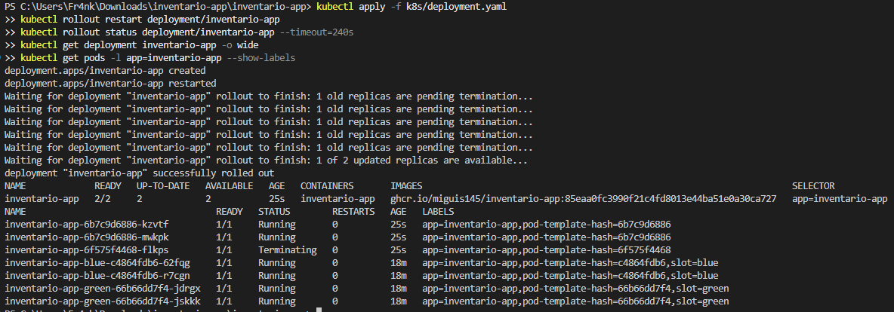

## 17. Acceso mediante port-forward

Exponer el Service en el puerto local `8080`:

```powershell
kubectl port-forward service/inventario-service 8080:80
```

Esa terminal debe permanecer abierta. Si se cierra o se presiona `Ctrl+C`, el acceso local deja de funcionar.

En otra ventana de PowerShell:

```powershell
$URL = "http://127.0.0.1:8080"

curl.exe "$URL/health"
curl.exe "$URL/version"
curl.exe "$URL/api/products"
```

La variable `$URL` solo existe en la ventana de PowerShell donde fue creada. Si se abre una terminal distinta, se debe ejecutar de nuevo la asignación.

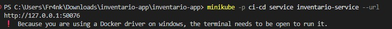

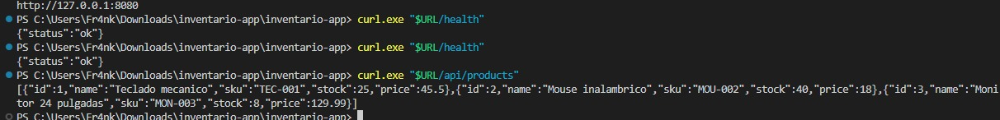

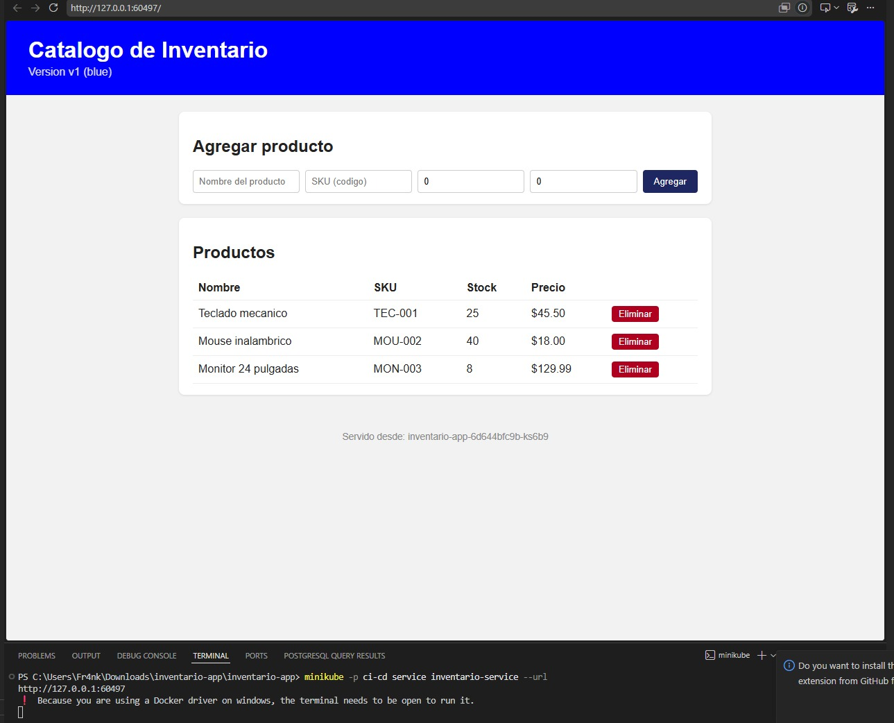

## 18. Prueba de recreación del pod y persistencia

1. Con el `port-forward` activo, crear un producto desde la interfaz en `http://127.0.0.1:8080` o desde la API.
2. Consultar el catálogo y anotar el producto creado.
3. Obtener el nombre de los pods.
4. Eliminar uno de ellos.
5. Observar cómo el Deployment crea un reemplazo.
6. Volver a consultar los productos.

Ejemplo de creación desde PowerShell:

```powershell
$Producto = @{
    name  = "PRODUCTO_DE_PRUEBA"
    sku   = "SKU_DE_PRUEBA"
    stock = 1
    price = 1
} | ConvertTo-Json

Invoke-RestMethod -Method Post -Uri "$URL/api/products" -ContentType "application/json" -Body $Producto
```

Para reproducir exactamente la evidencia incluida también se puede utilizar el cuerpo de `evidencias/product-request.json`:

```powershell
curl.exe -X POST "$URL/api/products" -H "Content-Type: application/json" --data-binary "@evidencias/product-request.json"
```

Comandos de observación:

```powershell
kubectl get pods
kubectl delete pod NOMBRE_DEL_POD
kubectl get pods -w
curl.exe "$URL/api/products"
```

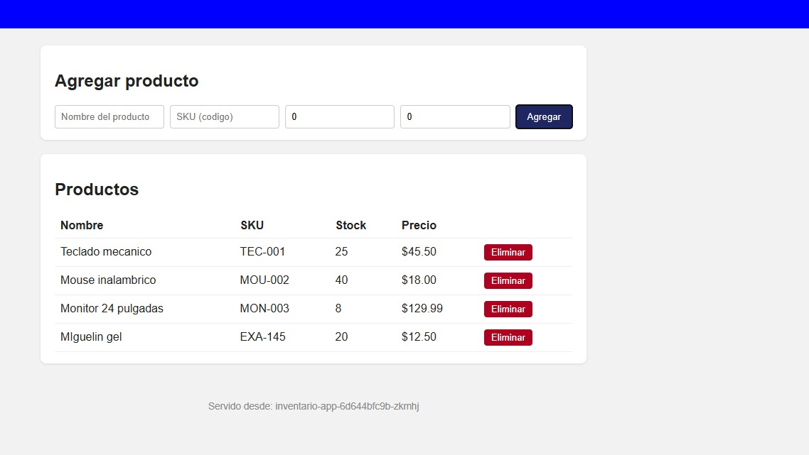

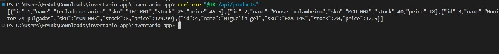

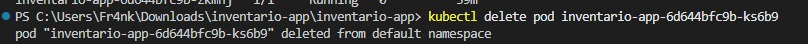

Se debe reemplazar `NOMBRE_DEL_POD` por uno de los nombres obtenidos con `kubectl get pods`. Para salir del modo de observación se utiliza `Ctrl+C`.

`db.js` guarda el catálogo en un archivo JSON local dentro de cada contenedor. El deployment no define un PersistentVolume ni otro almacenamiento compartido. Al eliminar un pod, se pierde el archivo de su contenedor y el pod nuevo crea otra copia con los productos iniciales. Como hay dos réplicas, cada una también puede responder con un catálogo diferente. El balanceo del Service puede hacer que un producto aparezca en una solicitud y no aparezca en la siguiente.

Este comportamiento debe documentarse como resultado del experimento, pero no se corrige en esta práctica.

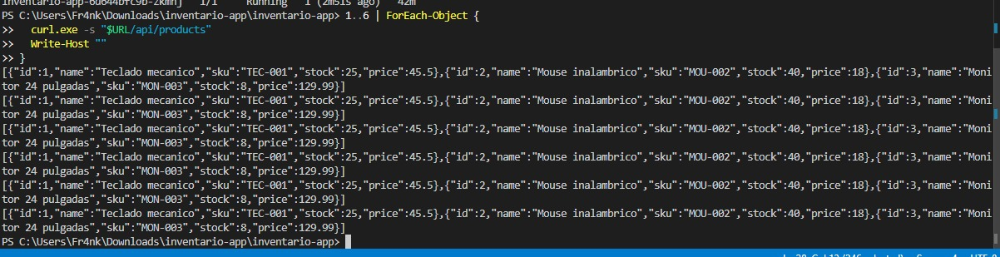

## 19. Estrategia Blue-Green

La estrategia utiliza dos Deployments independientes:

- `inventario-app-blue` ejecuta la versión estable `v1`.
- `inventario-app-green` ejecuta la versión nueva `v2`.

Los pods comparten la etiqueta `app: inventario-app` y se diferencian mediante `slot: blue` o `slot: green`. El Service envía tráfico únicamente al slot indicado por su selector.

En la verificación final, Green utiliza la imagen corregida `85eaa0fc3990f21c4fd8013e44ba51e0a30ca727`. Sus dos pods terminaron `Ready`, recibieron el Secret sin exponerlo y `/version` confirmó `apiKeyConfigured: true`.

Antes de aplicar los archivos, reemplazar las imágenes:

```yaml
# k8s/blue-green/deployment-blue.yaml
image: ghcr.io/TU_USUARIO_GITHUB/inventario-app:SHA_BLUE

# k8s/blue-green/deployment-green.yaml
image: ghcr.io/TU_USUARIO_GITHUB/inventario-app:SHA_GREEN
```

Con el Secret creado, ejecutar:

```powershell
kubectl delete deployment inventario-app --ignore-not-found

kubectl apply -f k8s/blue-green/deployment-blue.yaml
kubectl apply -f k8s/blue-green/deployment-green.yaml
kubectl apply -f k8s/blue-green/service.yaml

kubectl rollout status deployment/inventario-app-blue
kubectl rollout status deployment/inventario-app-green
kubectl get pods --show-labels
```

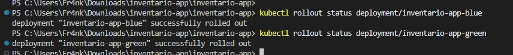

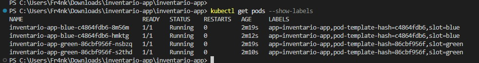

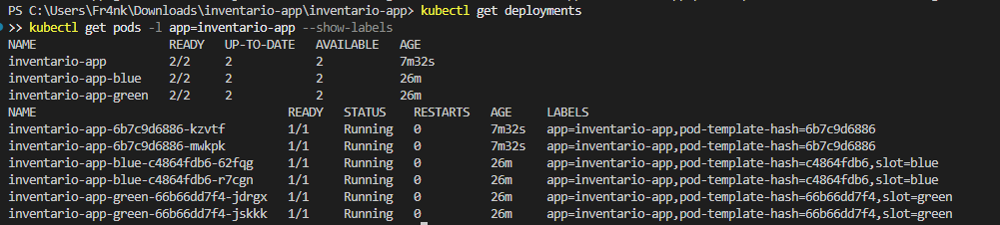

El Service de `k8s/blue-green/service.yaml` inicia con `slot: blue`. Aplicarlo sobre el Service base actualiza su selector porque ambos recursos se llaman `inventario-service`.

## 20. Obtención de SHA Blue y Green

Con el repositorio situado en la versión estable v1, obtener el primer SHA:

```powershell
git rev-parse HEAD
```

El resultado completo corresponde a `SHA_BLUE`. Se debe esperar a que el pipeline publique una imagen con esa etiqueta antes de usarla en `deployment-blue.yaml`.

Después de realizar y probar el cambio que identifica la versión Green, ejecutar:

```powershell
git add .
git commit -m "Crear versión green v2"
git push
git rev-parse HEAD
```

El segundo resultado corresponde a `SHA_GREEN`. Antes de `git add .` conviene ejecutar `git status` y comprobar que no haya credenciales, archivos temporales ni cambios ajenos a la práctica.

Los dos valores deben reemplazarse en los manifiestos:

```text
k8s/blue-green/deployment-blue.yaml  -> SHA_BLUE
k8s/blue-green/deployment-green.yaml -> SHA_GREEN
```

También se debe sustituir `TU_USUARIO_GITHUB` por el propietario real del paquete. Cada SHA debe corresponder a una ejecución correcta de GitHub Actions y a una etiqueta existente en GHCR.

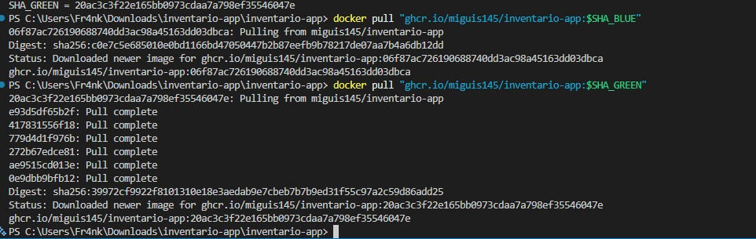

## 21. Cambio del tráfico a Green

Para evitar los problemas de comillas que puede producir `kubectl patch -p` en PowerShell, crear `patch-green.json` en la raíz del repositorio con este contenido:

```json
{"spec":{"selector":{"app":"inventario-app","slot":"green"}}}
```

Aplicar el parche y comprobar el resultado:

```powershell
kubectl patch service inventario-service --type merge --patch-file patch-green.json
kubectl get service inventario-service -o jsonpath="{.spec.selector.slot}"
```

Un `port-forward` ya abierto permanece conectado al pod que eligió al iniciarse. Después de cambiar el selector, detener el comando anterior con `Ctrl+C` y volver a ejecutarlo:

```powershell
kubectl port-forward service/inventario-service 8080:80
```

En la terminal donde se definió `$URL`:

```powershell
curl.exe "$URL/version"
```

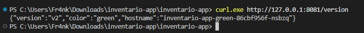

El primer comando modifica únicamente el selector del Service. La consulta `jsonpath` debe devolver `green`. La respuesta de `/version` debe contener `version: v2` y `color: green`, además del `hostname` del pod que atendió la solicitud.

La prueba final cambió el selector a Green, comprobó la respuesta `v2/green`, volvió temporalmente a Blue para demostrar el rollback y dejó el selector otra vez en Green. La salida real se conserva en [blue-green-final.txt](evidencias/blue-green-final.txt).

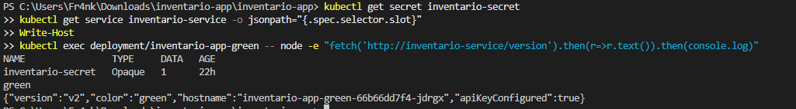

Si `$URL` no tiene valor en esa terminal, se debe volver a ejecutar:

```powershell
$URL = "http://127.0.0.1:8080"
```

## 22. Rollback a Blue

Crear `patch-blue.json` en la raíz del repositorio con este contenido:

```json
{"spec":{"selector":{"app":"inventario-app","slot":"blue"}}}
```

Aplicar el rollback:

```powershell
kubectl patch service inventario-service --type merge --patch-file patch-blue.json
kubectl get service inventario-service -o jsonpath="{.spec.selector.slot}"
```

Detener y volver a iniciar el `port-forward`, igual que en el cambio a Green. Después consultar:

```powershell
curl.exe "$URL/version"
```

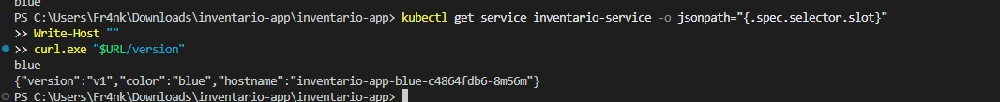

El selector debe volver a `blue`. La respuesta de `/version` debe mostrar `version: v1` y `color: blue`. No hace falta reconstruir la imagen ni recrear el Deployment Blue porque sus pods permanecieron en ejecución.

## 23. Justificación de Blue-Green

Blue-Green es apropiado para esta aplicación porque permite mantener la versión estable y la nueva versión en funcionamiento al mismo tiempo. Blue puede seguir atendiendo a los usuarios mientras se comprueban el estado, la versión y el catálogo de Green.

La promoción no reemplaza pods ni modifica imágenes en ejecución. Solo cambia la etiqueta `slot` que selecciona `inventario-service`. El endpoint `/version` permite demostrar de forma directa qué versión respondió, con su valor `v1` o `v2`, su color y el nombre del pod.

Si Green presenta un error, el mismo mecanismo devuelve el tráfico a Blue en pocos segundos. Esta separación reduce el riesgo durante la promoción y ofrece un rollback sencillo mientras la versión estable siga disponible.

## 24. Readiness con arranque lento

Los manifiestos declaran la variable:

```text
STARTUP_DELAY_SECONDS
```

La aplicación convierte esta variable a segundos y registra el instante en que se crea el servidor. Mientras no transcurra el retraso, `/health` responde HTTP `503` con `status: starting` y los segundos restantes. Al terminar, comprueba el acceso a los datos y responde HTTP `200` con `status: ok`.

Durante la prueba se utilizan:

```powershell
kubectl rollout restart deployment/inventario-app-blue
kubectl get pods -w
```

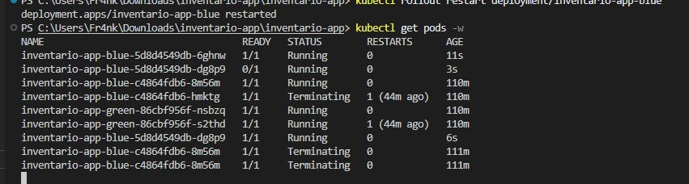

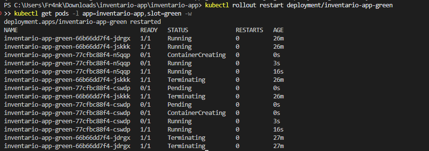

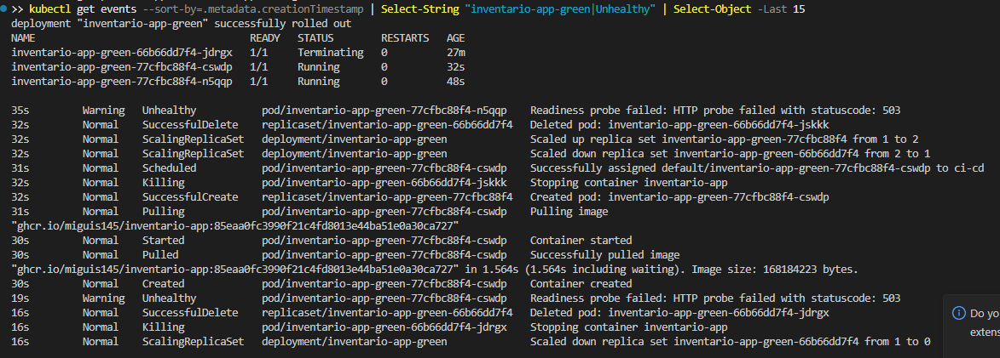

La transición esperada de un contenedor que ya se está ejecutando pero todavía no está listo es:

```text
Running 0/1
Running 1/1
```

La respuesta de la aplicación también se puede reproducir localmente:

```powershell
docker run -d --name inventario-delay -e STARTUP_DELAY_SECONDS=5 -p 3001:3000 inventario-app:local
curl.exe -i http://127.0.0.1:3001/health
Start-Sleep -Seconds 5
curl.exe -i http://127.0.0.1:3001/health
docker rm -f inventario-delay
```

La primera consulta debe devolver HTTP `503` y la segunda HTTP `200`.

El readiness probe consulta `/health` cada tres segundos después de un retraso inicial de dos segundos y admite hasta diez fallas consecutivas. Esa ventana tolera el retraso configurado de 10 o 15 segundos sin enviar tráfico al pod antes de tiempo. La liveness probe empieza después de 30 segundos, por lo que no reinicia el contenedor durante el arranque esperado.

Con la imagen corregida `85eaa0f…`, los eventos reales de Kubernetes registraron primero fallos de readiness por conexión rechazada y HTTP `503`; después los dos pods Green pasaron a `Running 1/1` y el rollout terminó correctamente. Esta secuencia está registrada en [blue-green-final.txt](evidencias/blue-green-final.txt).

Aumentar el número de réplicas no corrige este problema: solo crea más pods que seguirían respondiendo `503` durante su inicialización. La solución correcta es modelar el estado de preparación en `/health` y configurar el readiness probe con tiempos coherentes.

## 25. Problemas reales encontrados

### Trivy detuvo la publicación

- Qué ocurrió: el escaneo impidió que continuara el job al detectar una vulnerabilidad crítica.
- Por qué ocurrió: la imagen final heredó paquetes de la imagen base de Node.js, incluidas herramientas y dependencias internas de npm que también pueden contener vulnerabilidades.
- Cómo se diagnosticó: se revisó la tabla del paso `Escanear imagen con Trivy` en GitHub Actions para identificar el paquete, la versión instalada y la versión corregida. El repositorio no conserva el CVE, así que no se inventa uno.
- Cómo se solucionó: se redujo la imagen final a dependencias de producción, se limpió la caché y se eliminó npm y npx. Cuando la corrección depende de la base, también se debe usar una versión corregida y repetir el pipeline.

### BuildKit omitió inicialmente la etapa de pruebas

- Qué ocurrió: el primer `docker build` mostró únicamente los pasos de producción y no ejecutó `npm test`.
- Por qué ocurrió: la etapa `production` copiaba los archivos directamente desde el contexto y no dependía de la etapa `test`; BuildKit puede omitir las etapas que no contribuyen al resultado final.
- Cómo se diagnosticó: se revisó la salida del build y no aparecieron los pasos `[test]` ni el resultado de las pruebas.
- Cómo se solucionó: producción ahora copia `server.js`, `db.js` y `public/` desde `test`. Esa dependencia obliga a completar las pruebas antes de construir la imagen final.

### La variable de arranque lento no afectaba a `/health`

- Qué ocurrió: los manifiestos definían `STARTUP_DELAY_SECONDS`, pero el endpoint respondía `200` inmediatamente.
- Por qué ocurrió: `server.js` no leía la variable ni comparaba el tiempo transcurrido desde el inicio.
- Cómo se diagnosticó: se comparó el YAML con el código de `/health` y se comprobó que no existía ninguna referencia a la variable.
- Cómo se solucionó: `/health` ahora responde `503` durante el retraso y `200` al finalizar. Una prueba automática controla el reloj para validar ambos estados sin hacer más lenta la suite.

### Error de comillas con `kubectl patch -p`

- Qué ocurrió: PowerShell alteró o interpretó las comillas del JSON enviado con `-p`, y `kubectl` rechazó el parche.
- Por qué ocurrió: el JSON, PowerShell y la línea de comandos tienen reglas de escape distintas.
- Cómo se diagnosticó: el mensaje de `kubectl` indicó que el parche no era JSON válido o que no podía procesarlo; `kubectl get service inventario-service -o yaml` confirmó que el selector no había cambiado.
- Cómo se solucionó: se guardó el JSON en `patch-green.json` o `patch-blue.json` y se utilizó `--patch-file`.

### `$URL` apareció vacía

- Qué ocurrió: los comandos `curl.exe "$URL/..."` no apuntaron al servicio esperado.
- Por qué ocurrió: la variable se definió en otra ventana o en una sesión de PowerShell que ya había terminado.
- Cómo se diagnosticó: al ejecutar `Get-Variable URL -ErrorAction SilentlyContinue` no apareció un valor válido.
- Cómo se solucionó: se volvió a ejecutar `$URL = "http://127.0.0.1:8080"` en la terminal usada para las pruebas.

### El `port-forward` dejó de responder

- Qué ocurrió: la dirección local dejó de aceptar conexiones aunque los pods seguían activos.
- Por qué ocurrió: la terminal de `kubectl port-forward` se cerró, el comando se detuvo con `Ctrl+C` o perdió la conexión con el clúster.
- Cómo se diagnosticó: la ventana ya no mostraba el proceso activo y `Test-NetConnection 127.0.0.1 -Port 8080` no pudo establecer la conexión.
- Cómo se solucionó: se comprobó que el Service y los pods estaban disponibles y se ejecutó de nuevo `kubectl port-forward service/inventario-service 8080:80`.

### El selector cambió, pero el `port-forward` siguió en Blue

- Qué ocurrió: el selector del Service devolvió `green`, pero `/version` todavía respondió con `v1` y `blue`.
- Por qué ocurrió: `kubectl port-forward service/...` resuelve un pod al iniciar y mantiene la conexión con ese pod; no vuelve a seleccionar un destino por cada solicitud.
- Cómo se diagnosticó: se comparó `kubectl get service inventario-service -o jsonpath="{.spec.selector.slot}"` con el `hostname`, la versión y el color devueltos por `/version`.
- Cómo se solucionó: se detuvo y se inició de nuevo el `port-forward` después de cada cambio de selector.

### Estado `ImagePullBackOff` por una etiqueta inexistente

- Qué ocurrió: las dos réplicas del deployment base quedaron en `ErrImagePull` y después en `ImagePullBackOff`.
- Por qué ocurrió: el manifiesto apuntaba a una etiqueta SHA que ya no existía en GHCR; el registro respondió `manifest unknown`.
- Cómo se diagnosticó: `kubectl describe pod NOMBRE_DEL_POD` mostró el nombre de la imagen y el error de descarga, y la página pública de GHCR permitió comprobar las etiquetas disponibles.
- Cómo se solucionó: se reemplazó el SHA anterior por la etiqueta Blue publicada. Si el paquete fuera privado, también sería necesario configurar un `imagePullSecret` sin guardar el token en Git.

### Pérdida o inconsistencia de productos

- Qué ocurrió: un producto creado dejó de aparecer después de recrear un pod o apareció de forma intermitente entre solicitudes.
- Por qué ocurrió: cada réplica escribe su propio archivo `/app/data/products.json`, y esos archivos no se comparten ni sobreviven a la eliminación del pod.
- Cómo se diagnosticó: se compararon varias respuestas de `/api/products`, el `hostname` devuelto por `/version` y el comportamiento antes y después de `kubectl delete pod`.
- Cómo se solucionó: en esta práctica no se corrige. Se registra como evidencia de la necesidad de almacenamiento persistente o de una base de datos compartida en un entorno real.

## 26. Métricas DORA

Las métricas se recalcularon con dos promociones reales efectuadas el 25 de julio de 2026. Los tiempos de commit provienen de Git y el tiempo de despliegue corresponde al instante en que Kubernetes registró `NewReplicaSetAvailable`; no se utilizó la hora de publicación de GHCR como sustituto.

### Lead time for changes

Mide cuánto tiempo transcurre entre la creación del commit y su despliegue correcto:

```text
Lead time = fecha y hora del despliegue - fecha y hora del commit
```

Se utilizaron dos imágenes inmutables diferentes:

| Versión | SHA | Commit | Despliegue correcto en Minikube | Lead time |
|---|---|---|---|---:|
| Corrected release 1 | `8a26dc39cb6ae2d23aa39387d80169f7fe649c2a` | `2026-07-25T16:57:29-05:00` | `2026-07-25T17:01:00-05:00` | `00:03:31` |
| Corrected release 2 | `85eaa0fc3990f21c4fd8013e44ba51e0a30ca727` | `2026-07-25T17:02:01-05:00` | `2026-07-25T17:04:20-05:00` | `00:02:19` |

El lead time promedio es:

```text
(00:03:31 + 00:02:19) / 2 = 00:02:55
```

### Frecuencia de despliegue

Indica cuántos despliegues correctos se realizan durante un periodo:

```text
Frecuencia de despliegue = despliegues correctos / periodo observado
```

Durante la fecha medida se promovieron dos SHA distintos:

```text
Frecuencia = 2 despliegues correctos / 1 día = 2 despliegues por día
```

Los reinicios de readiness y la recarga de una imagen sin un nuevo commit no se cuentan como nuevas promociones, porque no introducen un cambio versionado distinto.

### Change failure rate

Mide el porcentaje de despliegues que provocaron una falla, un rollback o una corrección urgente:

```text
Change failure rate (%) = despliegues fallidos / despliegues totales × 100
```

Se conservaron tres intentos versionados en el conjunto auditado: el intento histórico apuntó a una etiqueta inexistente y terminó en `ImagePullBackOff`; las dos promociones corregidas terminaron correctamente.

```text
Change failure rate = 1 intento fallido / 3 intentos totales × 100
Change failure rate = 33,33 %
```

El CFR sigue siendo el resultado más débil porque el intento fallido se conserva de forma transparente. Las dos promociones posteriores demostraron que la corrección funciona: el pipeline terminó en verde, la etiqueta SHA existía en GHCR y el rollout llegó a disponibilidad completa. Para reducir el porcentaje en futuras ventanas se debe validar la existencia de la etiqueta antes de aplicar el manifiesto.

### Relación con la tabla de niveles DORA

Para interpretar los resultados se utiliza la tabla didáctica de cuatro niveles: **Élite, Alto, Medio y Bajo**. La comparación queda así:

| Métrica | Resultado propio | Rango de referencia | Nivel |
|---|---:|---|---|
| Lead time for changes | `00:02:55` | Menos de una hora | **Élite** |
| Frecuencia de despliegue | `2 despliegues por día` | Varios despliegues diarios | **Élite** |
| Change failure rate | `33,33 %` | Entre 31 % y 45 % | **Medio** |

La lectura conjunta no debe resumirse diciendo que todo el desempeño es Élite. La velocidad de entrega es **Élite** porque los cambios llegan al clúster en pocos minutos y se promovieron varias veces en un día. La estabilidad es **Media** porque uno de los tres intentos requirió una corrección. Por ello, el principal objetivo de mejora es reducir el change failure rate mediante la validación de la etiqueta SHA en GHCR antes del despliegue.

Estos niveles son una referencia didáctica para interpretar la práctica, no una certificación del proyecto. La muestra contiene solo tres intentos y debe recalcularse cuando exista un periodo de observación mayor.

Obtener las fechas de los últimos commits:

```powershell
git log --pretty=format:"%h | %cI | %s" -10
```

Registrar la hora real de cada despliegue:

```powershell
Get-Date -Format "yyyy-MM-ddTHH:mm:ssK"
```

Las capturas DORA anteriores se conservan como historial, pero no se usan para los valores recalculados porque corresponden a despliegues previos. Las fuentes actuales son [despliegue 8a26dc3](evidencias/despliegue-8a26dc3.txt), [despliegue 85eaa0f](evidencias/despliegue-85eaa0f.txt) y [dora-deployments.csv](evidencias/dora-deployments.csv). El intento fallido no tiene hora de despliegue porque nunca alcanzó disponibilidad; se conserva para calcular el change failure rate.

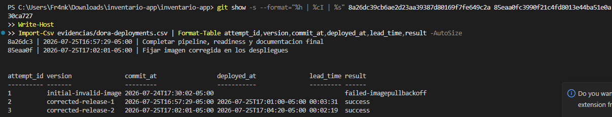

## 27. Evidencias

Las 69 capturas proporcionadas (48 JPG y 21 PNG) se conservaron con nombres descriptivos en `evidencias/capturas-reales/`. Las evidencias válidas se colocaron junto al comando correspondiente. Las seis capturas finales sustituyen los registros antiguos o incompletos de Rolling Update, Blue-Green, Secret, readiness y DORA.

El archivo [índice de capturas reales](evidencias/capturas-reales/indice.md) relaciona cada imagen con la sección de esta guía y la clasifica como evidencia principal, complementaria o no recomendable. Las imágenes antiguas, duplicadas, tomadas desde otra carpeta o que dejan visible un valor sensible no se utilizan como evidencia principal.

El entregable escrito de la Parte II está disponible en [Informe de reflexión CI/CD](output/pdf/Informe_Reflexion_CI_CD_Inventario.pdf). Tiene dos páginas e incluye la justificación Blue-Green, la observación sobre persistencia, los problemas encontrados y los tres resultados DORA.

La [entrega completa del proyecto](output/pdf/Entrega_Completa_Inventario_App.pdf) reúne el recorrido técnico, las evidencias principales y una sección ordenada de comandos para realizar la demostración.

| Número | Evidencia | Comando utilizado | Resultado esperado | Nombre o ruta de la captura |
|---:|---|---|---|---|
| 1 | Versiones de las herramientas | `node --version`, `npm.cmd --version`, `git --version`, `docker --version`, `kubectl version --client`, `minikube version` | Cada herramienta muestra su versión | [51-versiones-herramientas.png](evidencias/capturas-reales/51-versiones-herramientas.png) |
| 2 | Pruebas automáticas locales | `npm.cmd test` | Las seis pruebas terminan correctamente | [52-pruebas-automaticas.png](evidencias/capturas-reales/52-pruebas-automaticas.png) |
| 3 | Construcción multi-stage | `docker build -t inventario-app:local .` y `docker images inventario-app` | La etapa `test` termina y se crea la imagen de producción | [53-docker-build-multistage.png](evidencias/capturas-reales/53-docker-build-multistage.png) y [54-docker-images.png](evidencias/capturas-reales/54-docker-images.png) |
| 4 | Contenedor local | `docker run`, `docker ps`, `docker logs` y consultas con `curl.exe` | El contenedor está activo y sus endpoints responden | [55-docker-run-local.png](evidencias/capturas-reales/55-docker-run-local.png), [56-docker-ps-local.png](evidencias/capturas-reales/56-docker-ps-local.png), [57-docker-logs-local.png](evidencias/capturas-reales/57-docker-logs-local.png) y [58-endpoints-contenedor-local.png](evidencias/capturas-reales/58-endpoints-contenedor-local.png) |
| 5 | Jobs del pipeline | Ejecución de `.github/workflows/ci-cd.yml` | `build-test` y `build-push` terminan correctamente | [32-github-actions-dos-jobs.jpg](evidencias/capturas-reales/32-github-actions-dos-jobs.jpg) |
| 6 | Análisis de Trivy | Escaneo local con la misma versión y política del workflow | No se detectan vulnerabilidades `CRITICAL` en la imagen final comprobada | [59-trivy-sin-critical.png](evidencias/capturas-reales/59-trivy-sin-critical.png) |
| 7 | Etiquetas en GHCR | Página pública del paquete | Se observa el paquete publicado y la etiqueta disponible | [31-ghcr-paquete-publico.jpg](evidencias/capturas-reales/31-ghcr-paquete-publico.jpg) |
| 8 | Nodo de Minikube | `kubectl get nodes` y `minikube -p ci-cd status` | El nodo está `Ready` y los componentes están activos | [60-minikube-ready.png](evidencias/capturas-reales/60-minikube-ready.png) |
| 9 | Rolling Update | `kubectl rollout status deployment/inventario-app` y consultas de recursos | Dos SHA distintos terminan con las dos réplicas listas | [64-rolling-update-final.png](evidencias/capturas-reales/64-rolling-update-final.png), [despliegue-8a26dc3.txt](evidencias/despliegue-8a26dc3.txt) y [despliegue-85eaa0f.txt](evidencias/despliegue-85eaa0f.txt) |
| 10 | Recreación de un pod | `kubectl delete pod NOMBRE_DEL_POD` y `kubectl get pods -w` | Kubernetes elimina el pod y crea un reemplazo | [18-eliminacion-pod.jpg](evidencias/capturas-reales/18-eliminacion-pod.jpg) |
| 11 | Blue y Green activos | `kubectl get pods --show-labels` | Hay dos pods `slot=blue` y dos pods `slot=green` | [65-blue-green-activos-final.png](evidencias/capturas-reales/65-blue-green-activos-final.png) y [blue-green-final.txt](evidencias/blue-green-final.txt) |
| 12 | Tráfico en Green | Selector del Service y consulta al endpoint `/version` | La API informa `v2`, `green` y `apiKeyConfigured: true` | [66-service-green-secret-final.png](evidencias/capturas-reales/66-service-green-secret-final.png) y [blue-green-final.txt](evidencias/blue-green-final.txt) |
| 13 | Rollback a Blue | Selector del Service y `curl.exe "$URL/version"` | El selector es `blue` y la API informa `v1`, `blue` | [04-rollback-blue-version.jpg](evidencias/capturas-reales/04-rollback-blue-version.jpg) |
| 14 | Readiness | Eventos, pods y `kubectl rollout status` de Green con la imagen corregida | Se observa fallo HTTP `503` durante el arranque y después dos pods `1/1` | [67-readiness-green-transicion-final.png](evidencias/capturas-reales/67-readiness-green-transicion-final.png), [68-readiness-green-eventos-final.png](evidencias/capturas-reales/68-readiness-green-eventos-final.png) y [blue-green-final.txt](evidencias/blue-green-final.txt) |
| 15 | Persistencia local | Creación, consulta, eliminación del pod y nueva consulta | El producto local desaparece después de recrear el pod que lo guardó | [16-productos-despues-recreacion.jpg](evidencias/capturas-reales/16-productos-despues-recreacion.jpg) |
| 16 | Datos para métricas DORA | `git log`, condiciones de Deployment e `Import-Csv` | Se muestran los dos SHA, horas, lead times y resultados actuales | [69-dora-final.png](evidencias/capturas-reales/69-dora-final.png), [dora-deployments.csv](evidencias/dora-deployments.csv), [despliegue-8a26dc3.txt](evidencias/despliegue-8a26dc3.txt) y [despliegue-85eaa0f.txt](evidencias/despliegue-85eaa0f.txt) |

Las capturas deben mostrar el comando y su salida, sin incluir tokens, contraseñas ni el valor de `API_KEY`.

## 28. Limpieza

Detener el `port-forward` con `Ctrl+C`. Después, eliminar los recursos Blue-Green y detener Minikube:

```powershell
kubectl delete -f k8s/blue-green/service.yaml
kubectl delete -f k8s/blue-green/deployment-blue.yaml
kubectl delete -f k8s/blue-green/deployment-green.yaml
kubectl delete secret inventario-secret
minikube -p ci-cd stop
```

Si un recurso ya no existe, `kubectl` puede mostrar `NotFound`; esto no significa que los demás comandos de limpieza hayan fallado.

## 29. Conclusión

Al terminar la práctica pudimos seguir un cambio desde el commit hasta el pod que lo ejecuta. Las pruebas detuvieron errores antes de construir la imagen y Trivy revisó su seguridad antes de publicarla. Docker reunió la aplicación y sus dependencias; Kubernetes mantuvo las réplicas, comprobó su estado y reemplazó los pods cuando fue necesario. Se implementaron los tres componentes adicionales de la guía: Secret, Trivy y readiness con arranque lento.

Rolling Update y Blue-Green nos permitieron probar dos formas de actualizar la aplicación sin interrumpir el servicio. El cambio del selector mostró que un rollback puede ser rápido cuando la versión anterior sigue disponible. La pérdida e inconsistencia de productos también dejó claro que los contenedores no sustituyen una base de datos o un almacenamiento compartido.

Registrar los comandos, los SHA, las horas y las capturas fue parte del trabajo, no un paso decorativo. Esos datos permiten repetir el procedimiento y comprobar qué ocurrió en cada despliegue.
